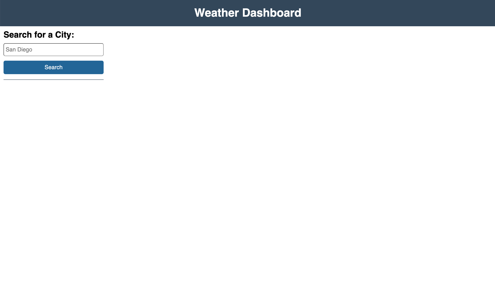
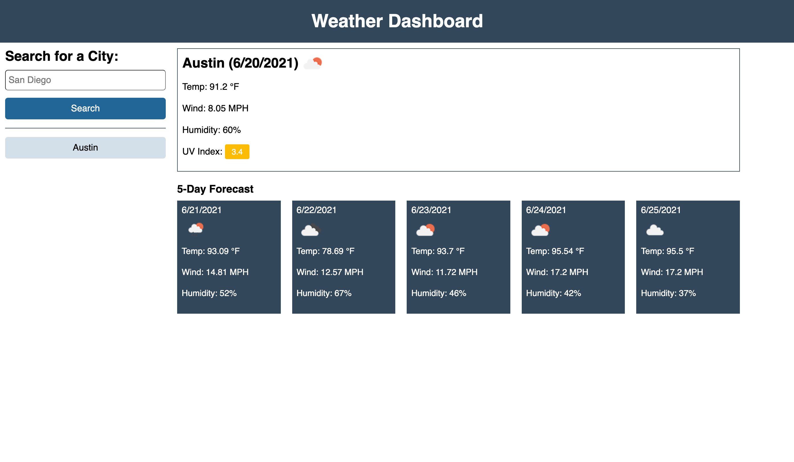
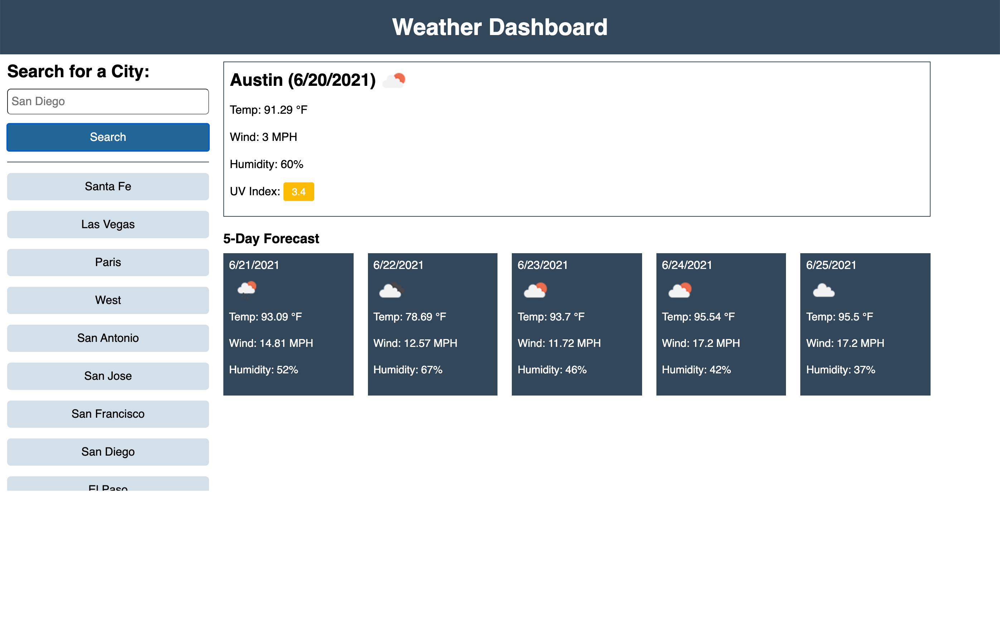

# Weather Dashboard
## Server-Side APIs Challenge

This repo contains the code for a weather dashboard. This challenge assignment displays my knowledge and ability to utilize server-side APIs and Javascript to manipulate HTML and CSS. 

Upon entering a valid city name, the weather dashboard will show the cities current weather, along with a 5-Day forecast.
Seach history is saved as buttons under the search input area. Clicking a search history button will show up-to-date weather information for that city. As the search history grows and reaches the set max-height, the area will turn scrollable. The user can also hover over the weather icons and see the icons description. The icons also contain alt text for screen readers. This page is fully responsive.

View the weather dashboard here: https://emholmes.github.io/api-weather-dashboard/ (deployed application)

